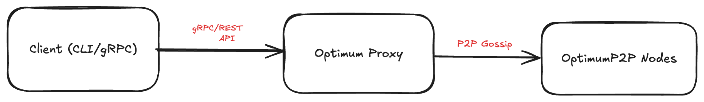
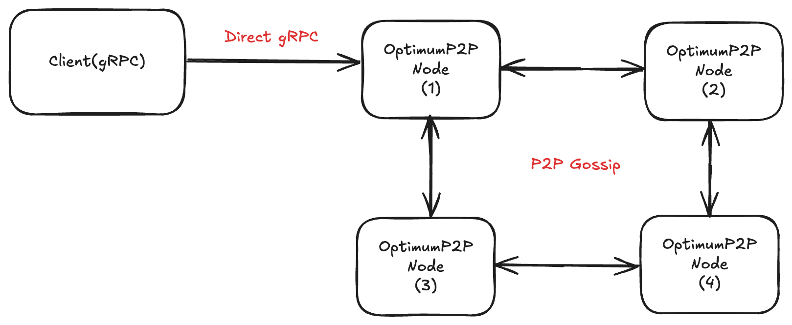

# Getting Started with Docker (Local Deployment)

Running **OptimumP2P** locally with Docker gives you **full control** over configuration, topology, and experiments.  
You can run the network in two primary ways:

**1. OptimumProxy + OptimumP2P** — Clients connect to an **Optimum Proxy**, which manages P2P connections for them.



* Simplifies client configuration — only the Proxy address is needed.
* Proxy handles shard reassembly, threshold logic, and node selection automatically.
* Easier scaling and centralized policy control.

**2. Direct OptimumP2P** — Clients connect directly to **OptimumP2P nodes** (each node must run the gRPC API).



* Fewer network hops = potentially lower latency.
* Clients must know node addresses and manage failover logic.
* Best for specialized or performance-critical workloads.


While the [mump2p-cli (Hosted Proxy)](./01-getting-started-cli.md) lets you get started instantly,  
local deployment offers:

* **Custom Configuration** — Tune thresholds, shard factors, and mesh sizes.
* **Full Control** — Decide how many nodes, their topology, and resource allocation.
* **Private Testing** — Run in isolated networks without using public proxies.
* **Advanced Experiments** — Simulate network conditions, failure scenarios, and scaling.

## Which mode should I use?

Choose the deployment mode that best fits your use case:

| **Mode A: Proxy + OptimumP2P** | **Mode B: Direct OptimumP2P** |
|---|---|
| **One endpoint** — simpler client config | **Lowest latency** — fewer network hops |
| **Policy control** — rate limiting, auth | **Direct control** — no proxy overhead |
| **Auto failover** — proxy handles node selection | **Manual failover** — clients manage addresses |

**Quick Decision:**

* **Want simpler setup and client code?** → **[Start with Mode A](#4-mode-a--optimumproxy--optimump2p-recommended)**  
* **Need maximum performance and control?** → **[Jump to Mode B](#5-mode-b--direct-optimump2p-advanced--lower-latency)**

## 1. Before You Start

### Requirements

* **[Docker](https://docs.docker.com/engine/install/)** — Container runtime for running OptimumP2P components
* **[Docker Compose](https://docs.docker.com/compose/install/)** — Tool for defining multi-container applications  
* **[Go v1.24+](https://golang.org/dl/)** — Required for building custom gRPC clients
* At least **2 GB free RAM** for running multiple nodes locally

> **Quick Docker Install:**
> 
> * **Linux**: `curl -fsSL https://get.docker.com | sh`
> * **macOS**: [Docker Desktop for Mac](https://docs.docker.com/desktop/install/mac-install/)
> * **Windows**: [Docker Desktop for Windows](https://docs.docker.com/desktop/install/windows-install/)  

### Components

| Component           | Purpose                                                                                                                                 | Docker Images               |
| ------------------- | --------------------------------------------------------------------------------------------------------------------------------------- | --------------------------- |
| **OptimumP2P Node** | RLNC-enabled mesh peer, encodes/decodes message shards, handles peer discovery and subscriptions. Optional gRPC API for direct clients. | `getoptimum/p2pnode:v0.0.1-rc2` |
| **Optimum Proxy**   | Bridges clients and the mesh, manages subscriptions, shard reassembly, threshold logic, and node selection.                             | `getoptimum/proxy:v0.0.1-rc3`   |


### Directory layout

Create a clean working folder:

```sh
mkdir -p ~/optimum-local/{proxy-p2p,direct-p2p,identity}
cd ~/optimum-local
```

We’ll keep identity in `./identity` folder so you can reuse keys across restarts.


## 2. Pick Your Mode

| Recommended mode              | Why                                                                                       |
| ----------------------------- | ----------------------------------------------------------------------------------------- |
| **OptimumProxy + OptimumP2P** | One endpoint for clients, proxy handles matching, decoding thresholds, fanout, and policy |
| **Direct OptimumP2P**         | Fewer hops, you control connection/retry logic and node selection                         |


## 3. Generate a Bootstrap Identity (once)

OptimumP2P nodes need a **P2P identity** (cryptographic keypair) for peer-to-peer communication. The bootstrap node needs a persistent identity so other nodes can discover it reliably.

**What is P2P Identity?**

* A cryptographic private key stored in `identity/p2p.key`
* Used for peer authentication and discovery
* Generates a unique **Peer ID** (like `12D3KooW...`) that other nodes use to connect

### Quick One-Command Setup

```bash
curl -sSL https://raw.githubusercontent.com/getoptimum/optimum-dev-setup-guide/main/script/generate-identity.sh | bash
```

This script:

* Creates `./identity/` directory
* Generates P2P keypair using the existing keygen utility
* Saves to `identity/p2p.key` with proper checksum format
* Exports `BOOTSTRAP_PEER_ID` environment variable
* Handles existing identity gracefully
* Uses the correct file format expected by OptimumP2P nodes

**Output:**

```bash
[INFO] Generating P2P Bootstrap Identity...
[INFO] Creating identity directory...
[INFO] Using existing keygen script...
[INFO] Generating P2P keypair...
[SUCCESS] Generated P2P identity successfully!
[SUCCESS] Identity saved to: ./identity/p2p.key
[SUCCESS] Peer ID: 12D3KooWLsSmLLoE2T7JJ3ZyPqoXEusnBhsBA1ynJETsziCKGsBw
[INFO] To use in docker-compose:
export BOOTSTRAP_PEER_ID=12D3KooWLsSmLLoE2T7JJ3ZyPqoXEusnBhsBA1ynJETsziCKGsBw
[SUCCESS] Done! Your OptimumP2P peer ID: 12D3KooWLsSmLLoE2T7JJ3ZyPqoXEusnBhsBA1ynJETsziCKGsBw
```

**What this creates:**

* `./identity/p2p.key` — JSON file containing the private key and peer ID
* `BOOTSTRAP_PEER_ID` environment variable for use in docker-compose files

> **Note:** This process creates a persistent identity that will be reused across container restarts. The `identity/` folder is mounted into containers so the same keypair is shared by the bootstrap node.

This guide covers:

* Setting up Docker Compose for both approach.
* Running and verifying the network.
* Connecting via CLI (`mump2p-cli`) or `gRPC clients` (Go examples included).
* Adjusting key parameters for your environment.

## 4. Mode A — OptimumProxy + OptimumP2P (Recommended)

### Create the docker-compose file

Save as `./proxy-p2p/docker-compose.yml`:

```yaml
services:
  proxy:
    image: 'getoptimum/proxy:v0.0.1-rc3'
    platform: linux/amd64
    environment:
      - PROXY_PORT=:8080                 # internal port, mapped below
      - CLUSTER_ID=proxy-1
      - ENABLE_AUTH=false                # set true in prod; see "Auth" below
      - LOG_LEVEL=debug
      # list of P2P node sidecar (gRPC) addresses (container DNS names)
      - P2P_NODES=p2pnode-1:33212,p2pnode-2:33212
    depends_on:
      - p2pnode-1
      - p2pnode-2
    ports:
      - "8081:8080"   # HTTP/WebSocket API (POST /publish, WS /ws, GET /health)
      - "50051:50051" # (optional) proxy gRPC, if exposed by your proxy build
    networks:
      testnet:
        ipv4_address: 172.28.0.10

  p2pnode-1:
    image: 'getoptimum/p2pnode:v0.0.1-rc2'
    platform: linux/amd64
    volumes:
      - ../identity:/identity
    environment:
      - LOG_LEVEL=debug
      - CLUSTER_ID=p2pnode-1
      - NODE_MODE=optimum           # or gossipsub
      - IDENTITY_DIR=/identity
      # Ports
      - SIDECAR_PORT=33212          # client/proxy gRPC port
      - API_PORT=9090               # node REST API
      - OPTIMUM_PORT=7070           # inter-node P2P
      # Mesh & RLNC
      - OPTIMUM_MESH_TARGET=6
      - OPTIMUM_MESH_MIN=3
      - OPTIMUM_MESH_MAX=12
      - OPTIMUM_MAX_MSG_SIZE=1048576
      - OPTIMUM_SHARD_FACTOR=4
      - OPTIMUM_SHARD_MULT=1.5
      - OPTIMUM_THRESHOLD=0.75
    ports:
      - "33221:33212"  # sidecar gRPC (host)
      - "9091:9090"    # node API (host)
      - "7071:7070"    # P2P (host; optional if single host only)
    networks:
      testnet:
        ipv4_address: 172.28.0.11

  p2pnode-2:
    image: 'getoptimum/p2pnode:latest'
    platform: linux/amd64
    environment:
      - LOG_LEVEL=debug
      - CLUSTER_ID=p2pnode-2
      - NODE_MODE=optimum
      - SIDECAR_PORT=33212
      - API_PORT=9090
      - OPTIMUM_PORT=7070
      - OPTIMUM_MAX_MSG_SIZE=1048576
      - OPTIMUM_MESH_TARGET=6
      - OPTIMUM_MESH_MIN=3
      - OPTIMUM_MESH_MAX=12
      - OPTIMUM_SHARD_FACTOR=4
      - OPTIMUM_SHARD_MULT=1.5
      - OPTIMUM_THRESHOLD=0.75
      # Bootstrap to node-1 (libp2p multiaddr)
      - BOOTSTRAP_PEERS=/ip4/172.28.0.11/tcp/7070/p2p/${BOOTSTRAP_PEER_ID}
    ports:
      - "33222:33212"
      - "9092:9090"
      - "7072:7070"
    networks:
      testnet:
        ipv4_address: 172.28.0.12

networks:
  testnet:
    driver: bridge
    ipam:
      config:
        - subnet: 172.28.0.0/16
```

*Why fixed IPs?*

It makes the bootstrap address deterministic `(/ip4/172.28.0.11/tcp/7070/p2p/<id>)`.
You can use the default bridge and service names, but then set `BOOTSTRAP_PEERS` to a reachable address.

See the [Parameter Section](./03-parameters.md) for config options and port usage.

### Start the Network

```sh
cd ~/optimum-local/proxy-p2p
export BOOTSTRAP_PEER_ID=<paste-from-step-2>
docker compose up -d
```

### Validate everything is healthy

```sh
docker compose ps
docker compose logs -f proxy | sed -n '1,120p
```

#### Health checks

```sh
# Proxy
curl -s http://localhost:8081/api/v1/version
curl -s http://localhost:8081/api/v1/health

# Nodes
curl -s http://localhost:9091/api/v1/health
curl -s http://localhost:9092/api/v1/health

# Peers seen by node-2 (should include node-1)
curl -s http://localhost:9092/api/v1/node-state | jq '.peers'
```

You should see the mesh forming and node-2 discovering node-1 via the bootstrap address.
<!-- TODO:: ref the github for available APIs from the proxy -->

### Send & receive (Proxy mode) using mump2p-cli

If you haven't already installed `mump2p-cli`, see the [**Getting Started with mump2p-cli**](./01-getting-started-cli.md) chapter.

**Subscribe:**

```sh
./mump2p subscribe --topic=demo --service-url=http://localhost:8081
```

**Publish (in a new terminal):**

```sh
./mump2p publish --topic=demo --message="Hello via Proxy" --service-url=http://localhost:8081
```

You should see your subscriber print the message immediately.


### Use Proxy using REST API and WebSocket (optional)

**Publish a message:**

```sh
curl -X POST http://localhost:8081/api/v1/publish \
  -H "Content-Type: application/json" \
  -d '{
    "client_id": "your-client-id",
    "topic": "example-topic",
    "message": "Hello, world!"
}'
```

**Parameters:**

* `client_id` – Unique identifier for the client (required)
* `topic` – The topic to publish the message to
* `message` – The content to broadcast to subscribers

> **Important:** The `client_id` field is required for all publish requests. This should be the same ID used when subscribing to topics. If you're using WebSocket connections, use the same `client_id` for consistency.

**Subscribe to a topic:**

```sh
curl -X POST http://localhost:8081/api/v1/subscribe \
  -H "Content-Type: application/json" \
  -d '{
    "client_id": "unique-client-id",
    "topic": "example-topic",
    "threshold": 0.7
}'
```

**Parameters:**

* `client_id` – Unique identifier for the client (required)
* `topic` – The topic to subscribe to
* `threshold` (optional, float) – Minimum percentage (0.1–1.0) of active nodes that must report a message before it's forwarded to this client
    * Default: 0.1 (10% confirmation)

**Connect via WebSocket:**

```sh
wscat -c "ws://localhost:8081/api/v1/ws?client_id=unique-client-id"
```

> **Important:** WebSocket has limitations, and you may experience unreliable delivery when publishing message bursts. A gRPC connection (shown below) provides more reliable streaming.

**Rate Limits:**

Rate limits are enforced based on client configuration. Exceeding limits results in 429 responses.

> **Note:** Since authentication is disabled in our local setup (`ENABLE_AUTH=false`), no JWT tokens are required for these requests.

### Use Proxy using gRPC Stream

For a complete working proxy client with both REST subscription and gRPC streaming, see the full implementation:

**[Complete Proxy Client Example](https://github.com/getoptimum/optimum-dev-setup-guide/blob/main/grpc_proxy_client/proxy_client.go)**

The proxy client provides:

* **REST API subscription** for topic registration and threshold configuration
* **gRPC bidirectional streaming** for real-time message delivery
* **Message publishing** via REST API endpoints
* **Configurable parameters** for topic, threshold, and message count
* **Flow control settings** for robust connections

```go
// Basic proxy client implementation (see full version in GitHub link above)
package main

import (
  "bytes"
  "context"
  "encoding/json"
  "fmt"
  "io"
  "log"
  "math"
  "net/http"
  "time"

  "google.golang.org/grpc"
  "google.golang.org/grpc/credentials/insecure"
  
  protobuf "proxy_client/grpc" // Generated from gateway_stream.proto
)

const (
  proxyREST = "http://localhost:8081"  // REST API for subscription/publishing
  proxyGRPC = "localhost:50051"        // gRPC endpoint for streaming
)

func main() {
  clientID := "client_demo123"
  topic := "demo"
  threshold := 0.1

  // 1. Subscribe via REST API
  body := map[string]interface{}{
    "client_id": clientID,
    "topic":     topic,
    "threshold": threshold,
  }
  data, _ := json.Marshal(body)
  resp, err := http.Post(proxyREST+"/api/v1/subscribe", "application/json", bytes.NewReader(data))
  if err != nil {
    log.Fatalf("subscription failed: %v", err)
  }
  resp.Body.Close()

  // 2. Connect to gRPC stream
  conn, err := grpc.NewClient(proxyGRPC,
    grpc.WithTransportCredentials(insecure.NewCredentials()),
    grpc.WithInitialWindowSize(1024*1024*1024),     // 1GB per-stream receive window
    grpc.WithInitialConnWindowSize(1024*1024*1024), // 1GB connection-level receive window
    grpc.WithDefaultCallOptions(
      grpc.MaxCallRecvMsgSize(math.MaxInt),
      grpc.MaxCallSendMsgSize(math.MaxInt),
    ),
  )
  if err != nil {
    log.Fatalf("gRPC connection failed: %v", err)
  }
  defer conn.Close()

  client := protobuf.NewProxyStreamClient(conn)
  stream, err := client.ClientStream(context.Background())
  if err != nil {
    log.Fatalf("stream creation failed: %v", err)
  }

  // 3. Send client ID to establish stream
  if err := stream.Send(&protobuf.ProxyMessage{ClientId: clientID}); err != nil {
    log.Fatalf("client ID send failed: %v", err)
  }

  // 4. Handle incoming messages
  go func() {
    for {
      resp, err := stream.Recv()
      if err == io.EOF {
        log.Println("Stream closed by server")
        return
      }
      if err != nil {
        log.Printf("Stream receive error: %v", err)
        return
      }
      log.Printf("Received: Topic=%s, Message=%s", resp.Topic, string(resp.Message))
    }
  }()

  // 5. Publish messages via REST API
  for i := 0; i < 3; i++ {
    msg := fmt.Sprintf("Hello message %d @ %s", i+1, time.Now().Format("15:04:05"))
    publishBody := map[string]interface{}{
      "client_id": clientID,
      "topic":     topic,
      "message":   msg,
    }
    publishData, _ := json.Marshal(publishBody)
    
    log.Printf("Publishing: %s", msg)
    resp, err := http.Post(proxyREST+"/api/v1/publish", "application/json", bytes.NewReader(publishData))
    if err != nil {
      log.Printf("Publish error: %v", err)
    } else {
      resp.Body.Close()
    }
    
    time.Sleep(2 * time.Second)
  }

  // Keep client running to receive messages
  time.Sleep(10 * time.Second)
}
```

## 5. Mode B — Direct OptimumP2P (Advanced / Lower Latency)

In this mode, clients connect `straight to node sidecar gRPC`. You’ll manage client-side reconnection, backoff, and which node to hit.

### Create the docker-compose file

Save as `./direct-p2p/docker-compose.yml`:

```yaml
services:
  p2pnode-1:
    image: 'getoptimum/p2pnode:latest'
    platform: linux/amd64
    volumes:
      - ../identity:/identity
    environment:
      - LOG_LEVEL=debug
      - CLUSTER_ID=p2pnode-1
      - NODE_MODE=optimum
      - IDENTITY_DIR=/identity
      - SIDECAR_PORT=33212
      - API_PORT=9090
      - OPTIMUM_PORT=7070
      - OPTIMUM_MESH_TARGET=6
      - OPTIMUM_MESH_MIN=3
      - OPTIMUM_MESH_MAX=12
      - OPTIMUM_MAX_MSG_SIZE=1048576
      - OPTIMUM_SHARD_FACTOR=4
      - OPTIMUM_SHARD_MULT=1.5
      - OPTIMUM_THRESHOLD=0.75
    ports:
      - "33221:33212"
      - "9091:9090"
      - "7071:7070"
    networks:
      testnet:
        ipv4_address: 172.28.0.11

  p2pnode-2:
    image: 'getoptimum/p2pnode:latest'
    platform: linux/amd64
    environment:
      - LOG_LEVEL=debug
      - CLUSTER_ID=p2pnode-2
      - NODE_MODE=optimum
      - SIDECAR_PORT=33212
      - API_PORT=9090
      - OPTIMUM_PORT=7070
      - OPTIMUM_MESH_TARGET=6
      - OPTIMUM_MESH_MIN=3
      - OPTIMUM_MESH_MAX=12
      - OPTIMUM_MAX_MSG_SIZE=1048576
      - OPTIMUM_SHARD_FACTOR=4
      - OPTIMUM_SHARD_MULT=1.5
      - OPTIMUM_THRESHOLD=0.75
      - BOOTSTRAP_PEERS=/ip4/172.28.0.11/tcp/7070/p2p/${BOOTSTRAP_PEER_ID}
    ports:
      - "33222:33212"
      - "9092:9090"
      - "7072:7070"
    networks:
      testnet:
        ipv4_address: 172.28.0.12

networks:
  testnet:
    driver: bridge
    ipam:
      config:
        - subnet: 172.28.0.0/16
```

### Start and validate

```sh
cd ~/optimum-local/direct-p2p
export BOOTSTRAP_PEER_ID=<paste-from-step-2>
docker compose up -d
docker compose ps
curl -s http://localhost:9091/api/v1/health
curl -s http://localhost:9092/api/v1/health
```

### Minimal Direct P2P sidecar gRPC stream client

For a complete working P2P client that connects directly to nodes, see the full implementation with trace handling:

**[Complete P2P Client Example](https://github.com/getoptimum/optimum-dev-setup-guide/blob/main/grpc_p2p_client/p2p_client.go)**

The client includes:

* **Message publishing and subscribing** with gRPC streaming
* **Protocol trace handling** for both GossipSub and OptimumP2P
* **Metrics collection** via `MessageTraceGossipSub` and `MessageTraceOptimumP2P` responses
* **Stress testing capabilities** with batch message publishing

```go
// Basic client skeleton (see full implementation in GitHub link above)
package main

import (
  "context"
  "fmt"
  "log"
  "math"

  "google.golang.org/grpc"
  "google.golang.org/grpc/credentials/insecure"
  
  protobuf "p2p_client/grpc" // Generated from p2p_stream.proto
)

func main() {
  conn, err := grpc.NewClient("localhost:33221",
    grpc.WithTransportCredentials(insecure.NewCredentials()),
    grpc.WithDefaultCallOptions(
      grpc.MaxCallRecvMsgSize(math.MaxInt),
      grpc.MaxCallSendMsgSize(math.MaxInt),
    ),
  )
  if err != nil { log.Fatal(err) }
  defer conn.Close()

  client := protobuf.NewCommandStreamClient(conn)
  stream, _ := client.ListenCommands(context.Background())
  
  // Subscribe to topic
  stream.Send(&protobuf.Request{
    Command: int32(CommandSubscribeToTopic),
    Topic: "demo",
  })
  
  // Handle responses including trace data
  for {
    resp, _ := stream.Recv()
    switch resp.GetCommand() {
    case protobuf.ResponseType_Message:
      fmt.Printf("MSG: %s\n", string(resp.GetData()))
    case protobuf.ResponseType_MessageTraceGossipSub:
      fmt.Printf("[TRACE] GossipSub trace: %d bytes\n", len(resp.GetData()))
    case protobuf.ResponseType_MessageTraceOptimumP2P:
      fmt.Printf("[TRACE] OptimumP2P trace: %d bytes\n", len(resp.GetData()))
    }
  }
}
```

For all available configuration variables, observability and validations check the [Parameters Section](./03-parameters.md).

## Troubleshooting

### No peers / mesh empty

* Check `BOOTSTRAP_PEERS` uses a reachable address of a running node.
* If using static IPs, confirm the `testnet` subnet and container IPs match the compose file.
* Look for `bootstrap` lines in docker compose logs `p2pnode`.

### “connection refused” from client

* Ensure you’re pointing to the host-mapped ports (e.g., 33221, 8081).
* Run docker compose ps and confirm port bindings.
* Firewalls: allow inbound localhost traffic.

### Proxy can’t reach nodes

* Inside the proxy container, resolve and ping node hosts:

```sh
docker compose exec proxy sh -lc 'nc -zv p2pnode-1 33212'
```

* Make sure `P2P_NODES` hostnames match the `service names` in compose.

### Port conflicts

* Change host mappings in ports: (e.g., 33223:33212, 9093:9090, 7073:7070).

### Protocol mismatch

* All nodes in a mesh must use the same NODE_MODE (optimum or gossipsub).

### Stop and Clean

Stop:

```sh
docker compose down
```

Full reset (containers, volumes, images created by this compose file):

```sh
docker compose down -v --rmi local
```
